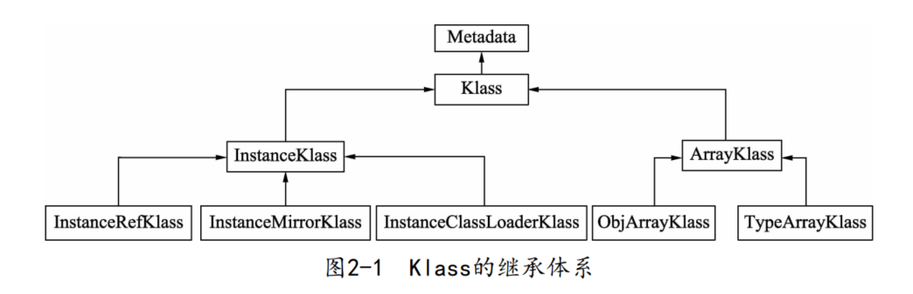
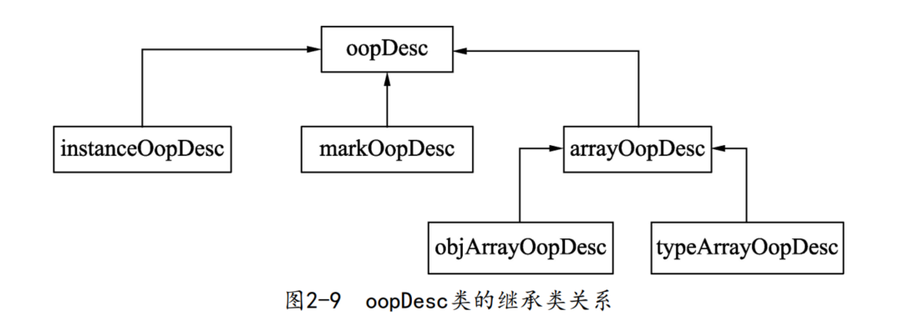
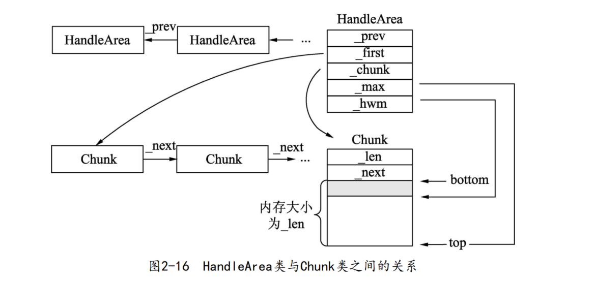

### openjdk

```text
—— corba：不流行的多语言、分布式通讯接口
—— hotspot：Java 虚拟机源码
—— jaxp：XML 处理
—— jaxws：一组 XML web services 的 Java API
—— jdk：java 开发工具包
—— —— 针对操作系统的部分
—— —— share：与平台无关的实现
—— langtools：Java 语言工具
—— nashorn：JVM 上的 JavaScript 运行时
```

### 二分模型

`HotSpot`采用`oop-Klass`模型表示`Java`的对象和类。`oop`（`ordinary object pointer`）指普通的对象指针，`Klass`表示对象的具体类型。

为何要设计一个一分为二的对象模型呢？这是因为`HotSpot`的设计者不想让每个对象中都含有一个`vtable`（虚函数表），所以就把对象模型拆成`Klass`和`oop`。其中，`oop`中不含有任何虚函数，自然就没有虚函数表，而`Klass`中含有虚函数表，可以进行方法的分发。

### Klass

`Java`类通过`Klass`来表示。简单来说`Klass`就是`Java`类在`HotSpot`中的`C++`对等体，主要用于描述`Java`对象的具体类型。一般而言，`HotSpotVM`在加载`Class`文件时会在元数据区创建`Klass`，表示类的元数据，通过`Klass`可以获取类的常量池、字段和方法等信息。



### oop

`Java`对象用`oop`来表示，在`Java`创建对象的时候创建。也就是说，在`Java`应用程序运行过程中每创建一个`Java`对象，在`HotSpot VM`内部都会创建一个`oop`实例来表示`Java`对象。



`markOopDesc`不是指`Java`对象，而是指`Java`对象的头信息，因此表示普通`Java`类对象的`instanceOopDesc`实例和表示数组对象的`objArrayOopDesc`与`typeArrayOopDesc`实例都含有`markOopDesc`实例。

### HandleArea 与 Chunk 类之间的关系



但是看代码好像 `HandleArea` 只会 `_prev = null`，因为只有thread初始化的时候会设置，其他地方没见到调用的地方。

### 对new重载不了解的话可以看这里

```
// operator new是函数，分为三种形式（前2种不调用构造函数，这点区别于new operator）：  
void* operator new (std::size_t size) throw (std::bad_alloc);  
void* operator new (std::size_t size, const std::nothrow_t& nothrow_constant) throw();  
void* operator new (std::size_t size, void* ptr) throw();
```

- 第一种分配`size`个字节的存储空间，并将对象类型进行内存对齐。如果成功，返回一个非空的指针指向首地址。失败抛出`bad_alloc`异常。  
- 第二种在分配失败时不抛出异常，它返回一个`NULL`指针。  
- 第三种是`placement new`版本，它本质上是对`operator new`的重载，定义于`#include <new>`中。它不分配内存，调用合适的构造函数在ptr所指的地方构造一个对象，之后返回实参指针`ptr`。

第一、第二个版本可以被用户重载，定义自己的版本，第三种`placement new`不可重载。
```
A* a = new A; //调用第一种  
A* a = new(std::nothrow) A; //调用第二种  
new (p)A(); //调用第三种
// new (p)A()调用placement new之后，还会在p上调用A::A()，这里的p可以是堆中动态分配的内存，也可以是栈中缓冲。  
```

```
// 这个是第三种的调用方式
int main() {
	char mem[100];
	mem[0] = 'A';
	mem[1] = '\0';
	mem[2] = '\0';
	mem[3] = '\0';
	cout << (void*)mem << endl;
	A* p = new (mem)A(2);
	cout << p << endl;
	p->show();
	p->~A();
}
```

**注意：`operator new`函数会被子类继承的，所以参数`size`的大小要注意。**

但是以上的几种又与`JDK`中的`HandleArea`分配又有区别。

`hotspot/src/share/vm/runtime/thread.cpp` 这里初始化 HandleArea的时候有点乱：

```
set_resource_area(new (mtThread)ResourceArea());
set_handle_area(new (mtThread) HandleArea(NULL));
```

`hotspot/src/share/vm/memory/allocation.cpp` 中不了解的话，可以看下面的例子。
```
#include <iostream>
using namespace std;

class A {
public:
	A(int n) {
		cout << "A's constructor" << endl;
        num = n;
	}
	void* A::operator new(size_t size, int flags) throw() {
		char mem[100];
		mem[0] = 'A';
		mem[1] = '\0';
		mem[2] = '\0';
		mem[3] = '\0';
		
		cout << (void*)mem << endl;
		cout << flags << endl;
		
		return (void*)mem;
	}
    ~A() {
		cout << "A's destructor" << endl;
	}
	virtual void show() {
		cout << "num:" << num << endl;
	}
	
private:
	int num;
};
 
int main() {
	A* p = new (100) A(2);
	cout << p << endl;
	p->show();
	p->~A();
}

// 输出结果为
// 0x66fe70
// 100
// A's constructor
// 0x66fe70
```

### 参考网址

[OpenJDK8的源代码介绍](https://www.likecs.com/show-110881.html)

[JVM之线程资源标记ResourceMark](https://blog.csdn.net/java_beautiful/article/details/126557871)

