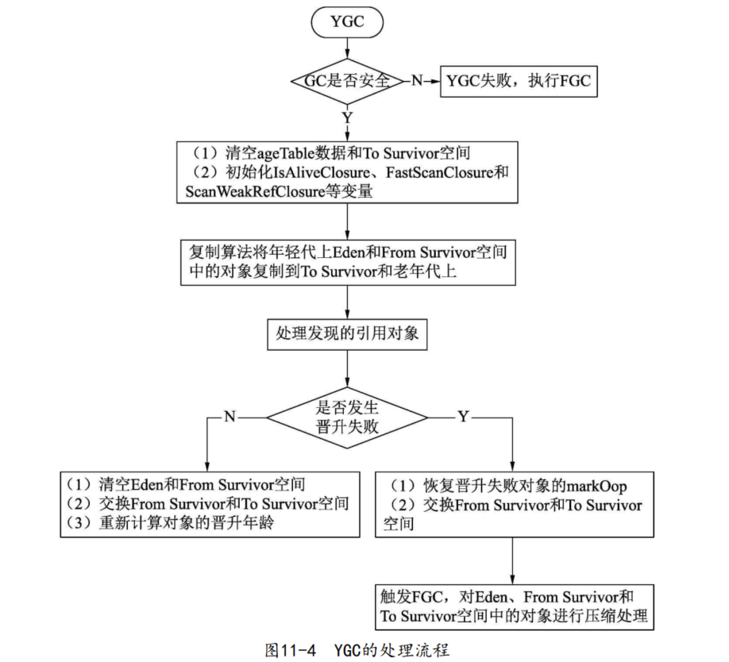

#### 解释执行的线程与VMThread线程的交互过程


#### 执行native的线程与VMThread线程的交互过程


#### YGC的处理流程



#### 年轻代到老年代的晋升过程的判断

1.长期存活的对象进入老年代

虚拟机给每个对象定义了一个对象年龄计数器。如果对象在`Eden`空间分配并经过第一次`YGC`后仍然存活，在将对象移动到`To Survivor`空间后对象年龄会设置为1。对象在`Survivor`空间每熬过一次，`YGC`年龄就加一岁，当它的年龄增加到一定程度（`默认为15岁`）时，就会晋升到老年代中。对象晋升老年代的年龄阈值，可以通过`-XX:MaxTenuringThreshold`选项来设置。`ageTable`类中定义`table_size`数组的大小为`16`，由于通过`-XX:Max-TenuringThreshold`选项可设置的最大年龄为`15`，所以数组的大小需要设置为`16`，因为还需要通过`sizes[0]`表示一次都未移动的对象，不过实际上不会统计`sizes[0]`， 因为`sizes[0]`的值一直为`0`。

2.动态对象年龄判定

为了能更好地适应不同程度的内存状况，虚拟机并不总是要求对象的年龄必须达到`MaxTenuringThreshold`才能晋升到老年代。如果在`Survivor`空间中小于等于某个年龄的所有对象空间的总和大于`Survivor`空间的一半，年龄大于或等于该年龄的对象就可以直接进入老年代，无须等到`MaxTenuringThreshold中`要求的年龄。因此需要通过`sizes`数组统计年轻代中各个年龄对象的总空间。

#### 根扫描源码

```
hotspot/src/share/vm/memory/sharedHeap.cpp

void SharedHeap::process_strong_roots() 函数
```

