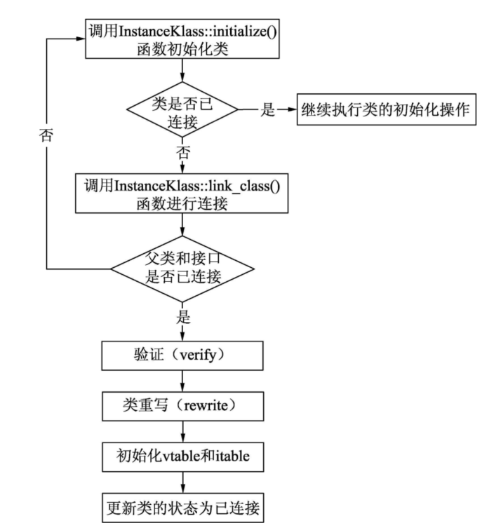

#### InstanceKlass::link_class_impl()函数的执行流程

#### 类的验证

类在连接过程中会涉及验证。`HotSpot VM`会遵守Java虚拟机的规范，对Class文件中包含的信息进行合法性验证，以保证`HotSpot VM`的安全。从整体上看，大致进行如下4方面的验证。

- 文件格式验证：包括魔数和版本号等；
- 元数据验证：对程序进行语义分析，如是否有父类，是否继承了不被继承的类，是否实现了父类或者接口中所有要求实现的方法；
- 字节码验证：指令级别的语义验证，如跳转指令不会跳转到方法体以外的代码上；
- 符号引用验证：符号引用转化为直接引用的时候，可以看作对类自身以外的信息进行匹配验证，如通过全限定名是否能找到对应的类等。

##### 1.文件格式验证

文件格式的验证大部分都会在解析类文件的`parseClassFile()`函数中进行，如对魔数和版本号的验证。

##### 2.元数据验证

元数据验证的逻辑大部分都在类解析`parseClassFile()`函数阶段完成。

##### 3.字节码验证

在`InstanceKlass::link_class_impl()`函数中调用verify_code()函数进行字节码验证。